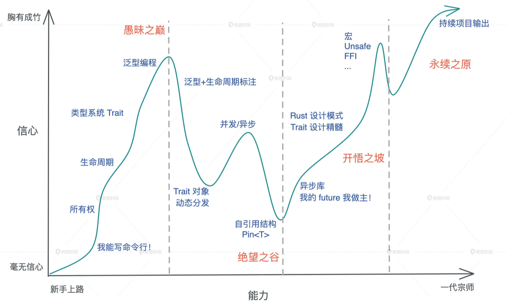

# Rust 入门分享 🦀

---

## 为什么学习 Rust❓

-----

1. 连续七年成为全世界最受欢迎的语言

<!-- rust日报：<a href="https://rustcc.cn/article?id=8cfed228-a988-4186-9692-dc44e36baed9#:~:text=Rust%20%E8%BF%9E%E7%BB%AD%E7%AC%AC%207%20%E5%B9%B4%E6%88%90%E4%B8%BA%E6%9C%80%E5%8F%97%E5%96%9C%E7%88%B1%E7%9A%84%E8%AF%AD%E8%A8%80%20Rust%20%E5%9C%A8%202022%20%E5%B9%B4%E7%9A%84,StackOverflow%20%E8%B0%83%E6%9F%A5%E4%B8%AD%E8%BF%9E%E7%BB%AD%E7%AC%AC%207%20%E5%B9%B4%E6%88%90%E4%B8%BA%E6%9C%80%E5%8F%97%E5%96%9C%E7%88%B1%E7%9A%84%E8%AF%AD%E8%A8%80%E3%80%82%20Rust%20%E4%BD%9C%E4%B8%BA%E6%9C%80%E5%8F%97%E5%96%9C%E7%88%B1%E7%9A%84%E8%AF%AD%E8%A8%80%E5%B7%B2%E7%BB%8F%E8%B5%B0%E8%BF%87%E4%BA%86%E7%AC%AC%E4%B8%83%E4%B8%AA%E5%B9%B4%E5%A4%B4%EF%BC%8C%2087%25%20%E7%9A%84%E5%BC%80%E5%8F%91%E8%80%85%E8%A1%A8%E7%A4%BA%E4%BB%96%E4%BB%AC%E6%83%B3%E7%BB%A7%E7%BB%AD%E4%BD%BF%E7%94%A8%E5%AE%83%E3%80%82">rust 日报</a> -->

<a href="https://survey.stackoverflow.co/2022/?utm_source=so-owned&utm_medium=announcement-banner&utm_campaign=dev-survey-2022&utm_content=results#most-loved-dreaded-and-wanted-language-want">stackoverflow survey</a>

-----

2. 没有 GC 也无需手动内存管理

<div style="font-size: 20px; color: #666;">
<ul>
<li>垃圾回收机制(GC)，在程序运行时不断寻找不再使用的内存，典型代表：Java、Go</li>
<li>手动管理内存的分配和释放, 在程序中，通过函数调用的方式来申请和释放内存，典型代表：C++</li>
<li>通过所有权来管理内存，编译器在编译时会根据一系列规则进行检查</li>
</ul>
</div>

```rust
{                      // s 在这里无效，它尚未声明
    let s = "hello";   // 从此处起，s 是有效的

    // 使用 s
}                      // 此作用域已结束，s不再有效
```

-----

3. 跨平台，可以编译为各系统的可执行文件

<!-- .slide: data-background-image="https://miro.medium.com/max/851/1*TLqYA0gwLrLAfXMGoTWFlQ.png" data-background-opacity="0.1" data-background-size="contain" -->
<a href="https://zhuanlan.zhihu.com/p/128626720" target="_blank">交叉编译</a>

-----

<!-- .slide: data-background="https://media.bitdegree.org/storage/media/images/2019/11/Rust-vs-C.jpg" data-background-opacity="0.1" data-background-size="contain" -->
4. <a href="https://www.jianshu.com/p/95884d1d04aa">性能比肩 C++/C 还能直接调用它们的代码、安全性极高</a>

-----

<!-- .slide: data-background="https://oscimg.oschina.net/oscnet/up-933d6cb2a65d5d7694422048292cdbd7ce5.jpg" data-background-opacity="0.1" data-background-size="contain" -->
5. Rust 将来可能会成为 Linux 内核开发的第二语言


-----

<!-- .slide: data-background="https://www.shuttle.rs/images/blog/ferris-error-handling.png" data-background-opacity="0.1" data-background-size="contain" -->
6. 极其严格的类型校验

<div class="fragment fade-in" style="margin-top: 1em;">
甚至是代码只要能跑起来或者编译通过了，就说明你的代码质量已经很不错了
</div>

-----

<!-- .slide: data-background="https://www.rust-lang.org/static/images/wasm-ferris.png" data-background-opacity="0.1" data-background-size="contain" -->
7. 可以编写 <a href="https://github.com/chenxiaochun/blog/blob/master/article/%E7%BC%96%E8%AF%91Rust%E4%B8%BAWebAssembly.md" target="_blank">webAssembly</a>

-----

<!-- .slide: data-background="https://img14.360buyimg.com/imagetools/jfs/t1/184097/14/32232/11986/633bf6d3Efa88ab3f/bbb7c32f21f04be8.png" data-background-opacity="0.1" -->
<a href="https://www.infoq.cn/article/ihlljbyidfxwkq17r_kq" target="_blank">8. 支持 npm 的核心身份验证服务</a>

<p class="fragment" style="font-size: 20px; margin-top: 1em; text-align: left;">
npm 的身份验证服务没那么复杂，以 Node.js 重写只花了一个小时。另一方面，Go 需要 2 天，但以 Rust 重写花了整整一个星期，主要是因为 Rust 的学习曲线更加陡峭以及该语言的内在复杂性<br /><br/>
—— Chris Dickinson 这样解释说
</p>

-----

<!-- .slide: data-background="https://img12.360buyimg.com/imagetools/jfs/t1/91779/10/31396/399571/6343f5faE44b5c5df/78cacf9bca4a6d9a.png" data-background-opacity="0.1" data-background-size="contain" -->
9. 著名设计工具 <a href="https://www.figma.com/files/recent?fuid=841590831032294578" target="_blank">figma</a> 网页版的运行实现

-----

<!-- .slide: data-background="https://img12.360buyimg.com/imagetools/jfs/t1/170748/16/31022/1383394/6344c25bE13d54838/32b61c89f9f4ca13.gif" data-background-opacity="0.1" data-background-size="contain" -->
10. 微信聊天里的『💣️💩』功能据说是用 webAssembly 实现的

-----

11. 更多...

https://github.com/i5ting/rust-fe

---

## 环境安装

-----

在 Linux 或 macOS 上安装 rust

```
$ curl --proto '=https' --tlsv1.2 https://sh.rustup.rs -sSf | sh
```

-----

在 Windows 上安装 rust，需要依赖于 C++ 环境

<a href="https://course.rs/first-try/installation.html#%E5%9C%A8-windows-%E4%B8%8A%E5%AE%89%E8%A3%85-rustup" target="_blank">安装教程</a>

-----

检查是否安装成功

```
$ rustc -V
rustc 1.58.0 (02072b482 2022-01-11)
```

---

## 编辑器插件安装🛠

-----

### VSCode 插件

-----

🚫 不推荐官方的 rust 插件，已经停止维护


-----

✅ 更推荐由社区驱动维护的 rust 插件


-----

就像其它语言插件一样，提供了以下特性：

```
1. 代码自动完成提示
2. 代码间的自动跳转
3. 语法高亮和代码检查
4. ....
```

-----

### Vim 插件

-----

```
Plugin 'rust-analyzer/rust-analyzer'
Plugin 'rust-lang/rust.vim'
```

```
let g:rustfmt_autosave = 1
```

```[7]
let g:ale_linters = {
\   'html': ['tidy'],
\   'less': ['stylelint'],
\   'javascript': ['eslint'],
\   'typescript': ['tsserver', 'eslint'],
\   'markdown': ['markdownlint'],
\   'rust': ['analyzer']
\}
```

---

## 认识 Cargo

<p class="fragment fade-up">一个优秀的包管理器非常重要 📦</p>

-----

创建项目

```
cargo new hello_world
```

<div class="fragment fade-up">
运行项目

```
cargo run
```
</div>


<div class="fragment fade-up">
编译项目

```shell
cargo build
```
</div>

-----

<div>
安装依赖

```
cargo install pkgName
```
</div>

<div class="fragment fade-up">
运行单元测试

```shell
cargo test
```
</div>

<div class="fragment fade-up">
项目检查

<div style="font-size: 16px;">
当项目大了后，cargo run 和 cargo build 不可避免的会变慢，可以更快的来验证代码的正确性
</div>

```shell
cargo check
```
</div>

---

## 一个普通的 rust 项目

-----

基础目录结构

```
.
├── Cargo.lock
├── Cargo.toml
├── hello.txt
├── src
│   ├── main.rs
│   └── multiplication_table.rs
└── target
    ├── CACHEDIR.TAG
    └── debug
        ├── build
        ├── deps
```

-----

Cargo.toml

```toml
[package]
name = "hello_world"
version = "0.1.0"
edition = "2021"

# See more keys and their definitions at https://doc.rust-lang.org/cargo/reference/manifest.html

[dependencies]

```

-----

Cargo.lock

```
# This file is automatically @generated by Cargo.
# It is not intended for manual editing.
version = 3

[[package]]
name = "hello_world"
version = "0.1.0"
```

---

## 下载依赖太慢了？

-----

在`$HOME/.cargo/config.toml`添加以下内容：

```toml
[source.crates-io]
replace-with = 'ustc'

[source.ustc]
registry = "git://mirrors.ustc.edu.cn/crates.io-index"
```

---

## Rust 语言学习

-----

从现在开始真正进入 rust 世界，<br />你会接触到很多新的概念🚀

-----

* 所有权、引用、借用
* 复合类型
* 泛型和特征
* 模式匹配
* 类型转换
* 宏编程
* 生命周期
* 智能指针
* 包和模块
* ...

-----

但是，不要害怕！

-----

<div class="fragment grow">
以上通通不讲，我们只讲点儿基础知识，<br/>因为我也不会🤪
</div>

-----

```rust[1-2|3-6|8-9|11-14|16-17|19-20|22-25|28-32]
// Rust 程序入口函数，跟其它语言一样，都是 main，该函数目前无返回值
fn main() {
   // 使用let来声明变量，进行绑定，a是不可变的
   // 此处没有指定a的类型，编译器会默认根据a的值为a推断类型：i32，有符号32位整数
   // 语句的末尾必须以分号结尾
   let a = 10;

   // 主动指定b的类型为i32
   let b: i32 = 20;

   // 这里有两点值得注意：
   // 1. 可以在数值中带上类型:30i32表示数值是30，类型是i32
   // 2. c是可变的，mut是mutable的缩写
   let mut c = 30i32;

   // 还能在数值和类型中间添加一个下划线，让可读性更好
   let d = 30_i32;

   // 跟其它语言一样，可以使用一个函数的返回值来作为另一个函数的参数
   let e = add(add(a, b), add(c, d));

   // println!是宏调用，看起来像是函数但是它返回的是宏定义的代码块
   // 该函数将指定的格式化字符串输出到标准输出中(控制台)
   // {}是占位符，在具体执行过程中，会把e的值代入进来
   println!("( a + b ) + ( c + d ) = {}", e);
}

// 定义一个函数，输入两个i32类型的32位有符号整数，返回它们的和
fn add(i: i32, j: i32) -> i32 {
  // 返回相加值，这里可以省略return
  i + j
}
```

-----

字符类型(char)

```rust
fn main() {
    let c = 'z';
    let z = 'ℤ';
    let g = '国';
    let heart_eyed_cat = '😻';
}
```

-----

布尔类型(bool)

```rust
fn main() {
    let t = true;

    let f: bool = false; // 使用类型标注,显式指定f的类型
}
```

-----

语句和表达式

```rust
fn main() {
  fn add_with_extra(x: i32, y: i32) -> i32 {
      let x = x + 1; // 语句
      let y = y + 5; // 语句
      x + y // 表达式。结尾没有分号，相当于 return x + y;
  }
}
```

-----

函数

```rust
fn main() {
    another_function(5, 6.1);
}

fn another_function(x: i32, y: f32) {
    println!("The value of x is: {}", x);
    println!("The value of y is: {}", y);
}
```

---

## 举几个例子🌰

-----

🌰本地`hello_world`示例

-----

自动热更新

```shell
cargo install cargo-watch
```

```shell
cargo watch -x run
```

-----

安装依赖包时，自动将信息加入到`Cargo.toml`

<p style="font-size: 20px; text-align: left;">
首先需要安装`cargo-edit`，然后就会获得一个扩展命令`cargo add`。以后使用它安装第三方依赖，就能将依赖信息自动写入`Cargo.toml`了
</p>

```shell
cargo install cargo-edit
```

```shell
cargo add mycrate
```

-----

<a href="https://github.com/chenxiaochun/blog/blob/master/article/%E7%BC%96%E8%AF%91Rust%E4%B8%BAWebAssembly.md" target="_blank">
🌰 Rust 编写 webAssembly 示例
</a>

---

## 相关教程📔

-----

* <a href="https://play.rust-lang.org/" target="_blank">rust playground</a>
* <a href="https://learn.microsoft.com/zh-cn/training/paths/rust-first-steps/" target="_blank">rust 待办事项小应用</a>
* <a href="https://github.com/chenxiaochun/blog/blob/master/article/%E7%BC%96%E8%AF%91Rust%E4%B8%BAWebAssembly.md" target="_blank">rust webAssembly</a>
* <a href="https://course.rs/about-book.html" target="_blank">Rust 语言圣经</a>

<div class="fragment zoom-in" style="margin-top: 20px;">都是入门级练习，只要按照步骤做，绝对能成功 ✌️</div>

---

## Rust 学习曲线📈

-----



---

# 💊

本次从入门到放弃，分享结束