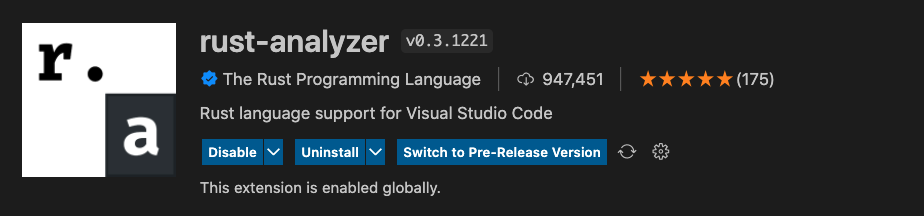

# Rust 入门分享 🦀

---

## 为什么学习 Rust？

-----

* 连续七年成为全世界最受欢迎的语言、没有 GC 也无需手动内存管理
* 性能比肩 C++/C 还能直接调用它们的代码、安全性极高

-----

* 跨平台，可以编译为各系统的可执行文件
* Rust 将来可能会成为 Linux 内核开发的第二语言

---

## 环境安装

-----

在 Linux 或 macOS 上安装 rust

```
$ curl --proto '=https' --tlsv1.2 https://sh.rustup.rs -sSf | sh
```

-----

在 Windows 上安装 rust，需要依赖于 C++ 环境

<a href="https://course.rs/first-try/installation.html#%E5%9C%A8-windows-%E4%B8%8A%E5%AE%89%E8%A3%85-rustup" target="_blank">安装教程</a>

-----

检查是否安装成功

```
$ rustc -V
rustc 1.58.0 (02072b482 2022-01-11)
```

---

## 编辑器插件安装

-----

### VSCode 插件

-----

🚫 不推荐官方的 rust 插件，已经停止维护


-----

✅ 更推荐由社区驱动维护的 rust 插件



-----

就像其它语言插件一样，提供了以下特性：

```
1. 代码自动完成提示
2. 代码间的自动跳转
3. 语法高亮和代码检查
4. ....
```

-----

### Vim 插件

-----

```
Plugin 'rust-analyzer/rust-analyzer'
Plugin 'rust-lang/rust.vim'
```

```
let g:rustfmt_autosave = 1
```

```[7]
let g:ale_linters = {
\   'html': ['tidy'],
\   'less': ['stylelint'],
\   'javascript': ['eslint'],
\   'typescript': ['tsserver', 'eslint'],
\   'markdown': ['markdownlint'],
\   'rust': ['analyzer']
\}
```

---

## 认识 Cargo

<p class="fragment fade-up">一个优秀的包管理器非常重要 📦</p>

-----

创建项目

```
cargo new hello_world
```

<div class="fragment fade-up">
运行项目

```
cargo run
```
</div>

<div class="fragment fade-up">
编译项目

```shell
cargo build
```
</div>

-----

运行单元测试

```shell
cargo test
```

<div class="fragment fade-up">
项目检查

<div style="font-size: 16px;">
当项目大了后，cargo run 和 cargo build 不可避免的会变慢，可以更快的来验证代码的正确性
</div>

```shell
cargo check
```
</div>

---

## 一个典型的 rust 项目目录结构

-----

```
.
├── Cargo.lock
├── Cargo.toml
├── src/
│   ├── lib.rs
│   ├── main.rs
│   └── bin/
│       ├── named-executable.rs
│       ├── another-executable.rs
│       └── multi-file-executable/
│           ├── main.rs
│           └── some_module.rs
└── tests/
    ├── some-integration-tests.rs
    └── multi-file-test/
        ├── main.rs
        └── test_module.rs
```

---

## Rust 核心配置文件

-----

### Cargo.toml

```toml
[package]
name = "hello_wasm"
version = "0.1.0"
edition = "2021"

[lib]
crate-type = ["cdylib", "rlib"]

[dependencies]
wasm-bindgen = "0.2"
```

-----

### Cargo.lock

```
# This file is automatically @generated by Cargo.
# It is not intended for manual editing.
version = 3

[[package]]
name = "bumpalo"
version = "3.9.1"
source = "registry+https://github.com/rust-lang/crates.io-index"
checksum = "a4a45a46ab1f2412e53d3a0ade76ffad2025804294569aae387231a0cd6e0899"

[[package]]
name = "cfg-if"
version = "1.0.0"
source = "registry+https://github.com/rust-lang/crates.io-index"
checksum = "baf1de4339761588bc0619e3cbc0120ee582ebb74b53b4efbf79117bd2da40fd"

[[package]]
name = "hello_wasm"
version = "0.1.0"
dependencies = [
 "wasm-bindgen",
]
...
```

---

## 下载依赖太慢了？

---

## Rust 基本概念

-----

<p style="font-size: 30px;">
从现在开始真正进入 rust 世界，将接触到很多新的概念
</p>

* 所有权、借用、生命周期
* 宏编程
* 模式匹配

-----

```rust[1-2|3-6|8-9|11-14|16-17|19-20|22-25|28-32]
// Rust 程序入口函数，跟其它语言一样，都是 main，该函数目前无返回值
fn main() {
   // 使用let来声明变量，进行绑定，a是不可变的
   // 此处没有指定a的类型，编译器会默认根据a的值为a推断类型：i32，有符号32位整数
   // 语句的末尾必须以分号结尾
   let a = 10;

   // 主动指定b的类型为i32
   let b: i32 = 20;

   // 这里有两点值得注意：
   // 1. 可以在数值中带上类型:30i32表示数值是30，类型是i32
   // 2. c是可变的，mut是mutable的缩写
   let mut c = 30i32;

   // 还能在数值和类型中间添加一个下划线，让可读性更好
   let d = 30_i32;

   // 跟其它语言一样，可以使用一个函数的返回值来作为另一个函数的参数
   let e = add(add(a, b), add(c, d));

   // println!是宏调用，看起来像是函数但是它返回的是宏定义的代码块
   // 该函数将指定的格式化字符串输出到标准输出中(控制台)
   // {}是占位符，在具体执行过程中，会把e的值代入进来
   println!("( a + b ) + ( c + d ) = {}", e);
}

// 定义一个函数，输入两个i32类型的32位有符号整数，返回它们的和
fn add(i: i32, j: i32) -> i32 {
  // 返回相加值，这里可以省略return
  i + j
}
```

-----

字符类型(char)

```rust
fn main() {
    let c = 'z';
    let z = 'ℤ';
    let g = '国';
    let heart_eyed_cat = '😻';
}
```

-----

布尔类型(bool)

```rust
fn main() {
    let t = true;

    let f: bool = false; // 使用类型标注,显式指定f的类型
}
```

-----

语句和表达式

```rust
fn main() {
  fn add_with_extra(x: i32, y: i32) -> i32 {
      let x = x + 1; // 语句
      let y = y + 5; // 语句
      x + y // 表达式。结尾没有分号，相当于 return x + y;
  }
}
```

-----

函数

```rust
fn main() {
    another_function(5, 6.1);
}

fn another_function(x: i32, y: f32) {
    println!("The value of x is: {}", x);
    println!("The value of y is: {}", y);
}
```

---

在线练习

* <a href="https://play.rust-lang.org/" target="_blank">rust playground</a>
* <a href="https://learn.microsoft.com/zh-cn/training/paths/rust-first-steps/" target="_blank">rust 待办事项小应用</a>
* <a href="https://github.com/chenxiaochun/blog/blob/master/article/%E7%BC%96%E8%AF%91Rust%E4%B8%BAWebAssembly.md" target="_blank">rust webAssembly</a>

<div class="fragment zoom-in" style="margin-top: 20px;">都是入门级练习，只要按照步骤做，绝对能成功 ✌️</div>

---

Rust 学习曲线


